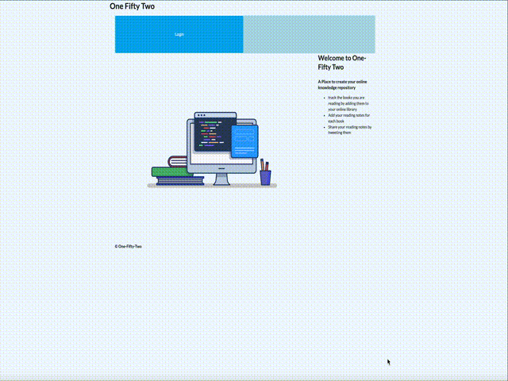

# One-Fifty-Two

- An application which lets the user track books read and also add notes for each book
- Built with JavaScript, CSS, React and Redux on the frontend

# Project Status

- This application is currently under active development

# Current Work In Progress

- A form which lets the user add notes for each book
- Integrate the search feature with the library component to have the search results and library display on the same page
- Additional Styling to make the UI appealing and responsive

# Planned Future Development

- Integration with Twitter API which lets the user tweet any notes from the note repository

# Project Preview

